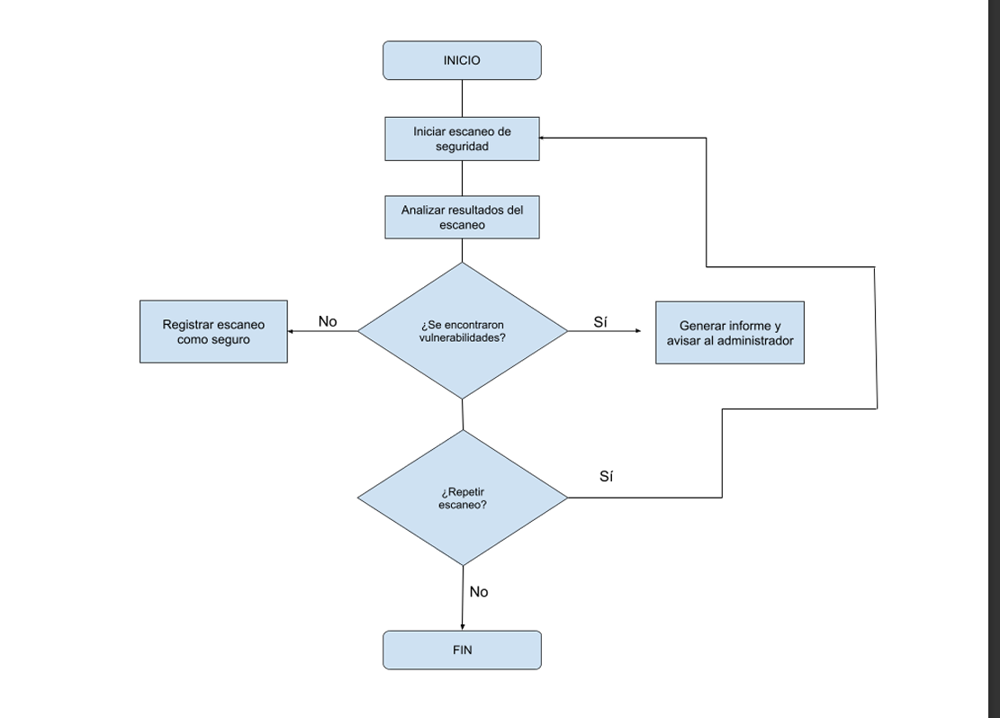

# CYBERSECURITY – Sistema de Auditorías y Análisis de Vulnerabilidades
Proyecto de documentación – Unidad 01 Actividad 07
---

## 1. Fundamentos del sistema
Este proyecto trata sobre un sistema de auditorías de seguridad.  
La idea es que sirva para ayudar a auditores y administradores de TI a detectar vulnerabilidades, hacer escaneos y generar informes de seguridad.

**Objetivos del sistema:**
- Automatizar tareas de análisis de seguridad.  
- Crear informes con gráficos y recomendaciones.  
- Avisar al administrador cuando se detecta una vulnerabilidad crítica.  
- Facilitar el trabajo del equipo de seguridad.

---

## 2. Análisis y especificación de requisitos

### Requisitos funcionales:
1. El auditor puede generar informes de seguridad.  
2. El administrador puede programar escaneos automáticos.  
3. El sistema envía avisos por correo cuando hay fallos críticos.  
4. Se pueden ver informes anteriores y compararlos.  

### Requisitos no funcionales:
1. Interfaz simple y clara.  
2. El sistema debe ser rápido (responder en pocos segundos).  
3. Los datos tienen que guardarse de forma segura.  
4. Debe funcionar desde cualquier navegador.

### Cómo saqué los requisitos
Usé varios métodos:
- Hablando con los usuarios (auditores y admins TI).  
- Haciendo una lluvia de ideas (brainstorming).  
- Imaginando casos de uso reales.  
- Creando un prototipo para probar ideas.  
- Haciendo reuniones de planificación con los “clientes”.

### Comunicación con los clientes
- Reuniones iniciales para entender lo que necesitaban.  
- Encuestas para decidir qué funciones eran más importantes.  
- Versión de prueba (beta) para recibir opiniones.  
- Un correo o chat de soporte para dudas.

---

## 3. Diseño
Este diagrama muestra el flujo de trabajo del escaneo de seguridad:

---

## 4. Implementación
Usé buenas prácticas al escribir el código y traté de hacerlo más limpio.

// Código antes (desordenado y repetitivo)
// Se encarga de comprobar si el usuario es "admin" sin importar mayúsculas/minúsculas
if (usuario === "admin" || usuario === "ADMIN" || usuario === "Admin") {
  console.log("Acceso permitido"); // Muestra en consola que el usuario puede entrar
}

// Código mejorado
// Primero convierto el nombre del usuario a minúsculas
// Luego comparo con "admin" para simplificar la condición
if (usuario.toLowerCase() === "admin") {
  console.log("Acceso permitido"); // Muestra en consola que el usuario puede entrar
}
